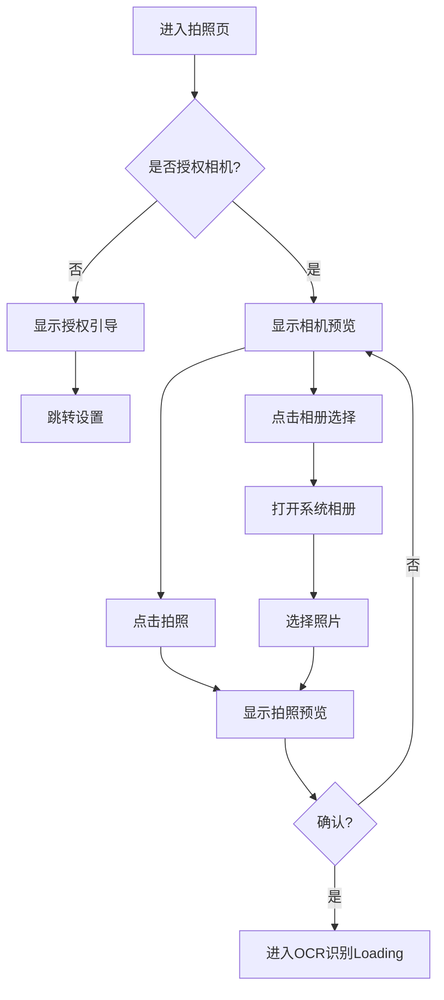

# KP作文宝 页面设计文档 - 缺失页面补充

> 本文档补充原型中缺失的关键页面设计，确保开发流程完整。

---

## 页面清单

| 页面 | PRD提及 | 原型状态 | 本文档状态 |
|------|---------|----------|------------|
| 首页 | ✅ | ✅ | 已有 |
| 拍照页 | ✅ | ❌ | **本文档补充** |
| 批改结果页 | ✅ | ✅ | 已有 |
| 易错点页 | ✅ | ✅ | 已有 |
| 亮点库页 | ✅ | ✅ | 已有 |
| 字帖生成页 | ✅ | ❌ | **本文档补充** |
| 历史记录页 | ✅ | ❌ | **本文档补充** |
| 我的页 | ✅ | ❌ | **本文档补充** |
| Loading状态 | ✅ | ❌ | **本文档补充** |
| 空状态 | ❌ | ❌ | **本文档补充** |
| 错误状态 | ❌ | ❌ | **本文档补充** |

---

# 一、拍照页 (Photo Capture Page)

## 1.1 页面概述

**页面ID**: `page-capture`
**进入方式**: 首页点击"拍照批改"按钮
**页面目的**: 引导用户正确拍摄或选择作文照片

## 1.2 页面布局

```
┌─────────────────────────────────┐
│ 状态栏                           │ 44px
├─────────────────────────────────┤
│ ← 返回               相册选择    │ 52px (导航栏)
├─────────────────────────────────┤
│                                 │
│    ┌───────────────────────┐   │
│    │                       │   │
│    │    相机取景区域        │   │ ← 全屏相机
│    │                       │   │   横屏答题卡框
│    │    ┌─────────────┐    │   │
│    │    │             │    │   │
│    │    │  答题卡框    │    │   │
│    │    │  (半透明)   │    │   │
│    │    │             │    │   │
│    │    └─────────────┘    │   │
│    │                       │   │
│    └───────────────────────┘   │
│                                 │
├─────────────────────────────────┤
│      📷        [相册图标]       │ 100px (底部操作区)
│     拍照       相册选择         │
└─────────────────────────────────┘
```

## 1.3 视觉规范

### 相机取景区域
```
背景: 实时相机预览
辅助框:
  - 尺寸: 宽度 85%, 高度自适应 (约 60% 屏幕高)
  - 边框: 2px dashed rgba(255,255,255,0.8)
  - 圆角: 8px
  - 四角标记: 20px 长的白色边角 (2px 宽)

辅助文字 (框上方):
  - 内容: "请将作文放入框内，确保光线充足"
  - 颜色: rgba(255,255,255,0.9)
  - 字号: 14px
  - 背景: rgba(0,0,0,0.4)
  - 圆角: 20px
  - 内边距: 8px 16px
```

### 底部操作区
```
背景: rgba(0,0,0,0.6) (毛玻璃效果)
backdrop-filter: blur(10px)
高度: 100px
内边距: 20px 40px

拍照按钮:
  - 尺寸: 64px × 64px
  - 背景: 白色
  - 圆角: 50%
  - 图标: fa-camera, 28px, --neutral-900
  - 边框: 4px solid rgba(255,255,255,0.3)
  - 按下: transform: scale(0.95), background: --neutral-200

相册按钮:
  - 尺寸: 48px × 48px
  - 背景: rgba(255,255,255,0.2)
  - 圆角: 12px
  - 图标: fa-images, 24px, white
  - 按下: background: rgba(255,255,255,0.3)
```

## 1.4 交互流程



## 1.5 拍照预览页

**触发**: 拍照完成后
**布局**:
```
┌─────────────────────────────────┐
│ 状态栏                           │
├─────────────────────────────────┤
│ ← 重拍                           │
├─────────────────────────────────┤
│                                 │
│      [照片预览大图]              │
│                                 │
├─────────────────────────────────┤
│    "照片是否清晰可辨？"          │
│                                 │
│    [✓ 确认并识别]               │
│    [⟲ 重新拍摄]                 │
└─────────────────────────────────┘
```

**按钮样式**:
- 确认按钮: 主按钮样式 (Primary Button), 文字 "确认并识别"
- 重拍按钮: 次要按钮样式 (Secondary Button), 文字 "重新拍摄"

---

# 二、OCR识别 Loading 页

## 2.1 页面概述

**页面ID**: `page-ocr-loading`
**触发**: 确认照片后
**页面目的**: 缓解用户等待焦虑，展示处理进度

## 2.2 页面布局

```
┌─────────────────────────────────┐
│ 状态栏                           │
├─────────────────────────────────┤
│                                 │
│                                 │
│                                 │
│       [动画图标区域]             │
│                                 │
│       ┌─────────────┐           │
│       │             │           │
│       │   📄→🔍→✓   │           │ 动画流程
│       │             │           │
│       └─────────────┘           │
│                                 │
│       "正在识别作文内容..."       │
│       "已识别 3/5 行"            │
│                                 │
│       [=========    ] 60%       │
│                                 │
│       预计剩余 5 秒              │
│                                 │
│                                 │
└─────────────────────────────────┘
```

## 2.3 视觉规范

### 动画区域
```
容器尺寸: 120px × 120px
动画:
  - 阶段1: 扫描动画 (1.5s)
    - 一条水平线从上往下扫描照片图标
  - 阶段2: 文字识别动画 (1s)
    - 文字逐个出现效果
  - 阶段3: 完成动画 (0.5s)
    - 对勾缩放出现

背景: --primary-50 (#E8F0FE)
圆角: 50%
```

### 进度条
```
容器:
  - 宽度: 200px
  - 高度: 6px
  - 背景: --neutral-200
  - 圆角: 3px

进度:
  - 高度: 100%
  - 背景: 线性渐变 90deg, --primary-400 → --primary-500
  - 圆角: 3px
  - 过渡: width 0.3s ease-out
```

### 文字
```
主标题: "正在识别作文内容..."
  - 字号: 18px, 600, --neutral-800

副标题: 动态更新进度
  - 字号: 14px, 400, --neutral-600

倒计时: "预计剩余 X 秒"
  - 字号: 13px, 400, --neutral-500
```

## 2.4 AI批改 Loading 页

**页面ID**: `page-correction-loading`
**触发**: OCR识别完成后

**布局差异**:
- 动画图标: AI分析动画 (大脑/神经网络图标脉动)
- 主标题: "AI正在批改作文..."
- 副标题: 滚动显示分析维度 "正在分析语法..." → "正在分析词汇..." → "正在生成范文..."
- 预计时间: 10-15秒

---

# 三、字帖生成与预览页

## 3.1 页面概述

**页面ID**: `page-copybook-preview`
**进入方式**: 批改结果页点击"生成衡水体字帖"
**页面目的**: 预览并下载/打印字帖PDF

## 3.2 页面布局

```
┌─────────────────────────────────┐
│ 状态栏                           │
├─────────────────────────────────┤
│ ← 返回              分享        │
│      字帖预览                    │
├─────────────────────────────────┤
│                                 │
│    ┌─────────────────────┐     │
│    │                     │     │
│    │   [PDF预览缩略图]    │     │ ← 可滚动
│    │                     │     │
│    │   答题卡格式模拟     │     │
│    │                     │     │
│    └─────────────────────┘     │
│                                 │
│    第 1 / 2 页                  │
│                                 │
│    ● ○                          │
├─────────────────────────────────┤
│  字体: [默认手写体 ▼]           │
├─────────────────────────────────┤
│    [📥 下载PDF]  [🖨️ 打印]      │
│                                 │
│    [📤 分享给好友]              │
└─────────────────────────────────┘
```

## 3.3 视觉规范

### PDF预览区域
```
容器:
  - 宽度: calc(100% - 40px)
  - 高度: 400px
  - 背景: --neutral-200 (模拟纸张背景)
  - 边框: 1px solid --neutral-300
  - 圆角: 8px
  - 阴影: 0 4px 12px rgba(0,0,0,0.1)

内容:
  - 模拟答题卡横线
  - 行高: 24px
  - 横线颜色: #E0E0E0
  - 范文文字: 使用手写体 (Gochi Hand 或衡水体)
  - 字体大小: 18px

页码指示器:
  - 尺寸: 8px 圆形
  - 默认: --neutral-300
  - 当前: --primary-500
  - 间距: 8px
```

### 字体选择器
```
容器:
  - 高度: 48px
  - 背景: --neutral-100
  - 圆角: 12px
  - 内边距: 0 16px
  - 边框: 1px solid --neutral-200

左侧文字: "字体"
  - 14px, --neutral-600

右侧选择:
  - 文字: 14px, --neutral-800, 600
  - 图标: fa-chevron-down, 12px
  - 颜色: --neutral-500

展开选项 (Dropdown):
  - 背景: white
  - 圆角: 12px
  - 阴影: 0 8px 24px rgba(0,0,0,0.12)
  - 选项高度: 44px
  - 选中态: 背景 --primary-50, 文字 --primary-600
```

### 操作按钮区
```
主按钮 (下载PDF):
  - 高度: 48px
  - 背景: --primary-500
  - 文字: white, 16px, 600
  - 图标: fa-circle-down, 18px, 间距 8px
  - 宽度: 48%

主按钮 (打印):
  - 同下载按钮
  - 图标: fa-print

次按钮 (分享):
  - 高度: 44px
  - 边框: 1.5px solid --primary-500
  - 文字: --primary-500, 15px, 600
  - 图标: fa-share-nodes
  - 宽度: 100%
```

## 3.4 生成中 Loading

**触发**: 点击"生成衡水体字帖"后
**动画**: PDF图标 + 进度环
**文案**: "正在生成字帖..." → "正在排版答题卡格式..." → "正在渲染字体..."
**预计时间**: 2-3秒

---

# 四、历史记录页

## 4.1 页面概述

**页面ID**: `page-history`
**进入方式**: 首页点击"查看全部"
**页面目的**: 查看所有批改记录

## 4.2 页面布局

```
┌─────────────────────────────────┐
│ 状态栏                           │
├─────────────────────────────────┤
│ ← 返回                           │
│      批改历史                    │
├─────────────────────────────────┤
│ 筛选: [全部 ▼]  [本月 ▼]        │
├─────────────────────────────────┤
│                                 │
│ ┌─────────────────────────────┐ │
│ │ 📄 My Favorite Hobby        │ │
│ │    2026-03-16  14:30        │ │
│ │    PET 评分: 24/30          │ │
│ │    [查看详情]               │ │
│ └─────────────────────────────┘ │
│                                 │
│ ┌─────────────────────────────┐ │
│ │ 📄 A Special Day            │ │
│ │    2026-03-15  10:20        │ │
│ │    PET 评分: 27/30          │ │
│ └─────────────────────────────┘ │
│                                 │
│ ... 更多记录 ...                │
│                                 │
└─────────────────────────────────┘
```

## 4.3 视觉规范

### 筛选栏
```
高度: 48px
背景: white
边框: 1px solid --neutral-200 (底部)
内边距: 0 20px

筛选按钮:
  - 高度: 32px
  - 背景: --neutral-100
  - 圆角: 16px
  - 内边距: 0 12px
  - 文字: 13px, --neutral-700
  - 图标: fa-chevron-down, 10px, 间距 4px
```

### 历史记录卡片
```
背景: white
圆角: 16px
内边距: 16px
阴影: --shadow-sm
外边距: 12px 0

标题行:
  - 图标: fa-file-lines, 18px, --primary-500
  - 标题: 16px, 600, --neutral-800, 间距 8px
  - 右侧: 更多操作图标 fa-ellipsis-vertical

日期:
  - 字号: 13px, --neutral-500
  - 图标: fa-clock, 12px, 间距 4px

分数标签:
  - 背景: --primary-50
  - 文字: --primary-600, 14px, 600
  - 圆角: 12px
  - 内边距: 4px 10px

操作按钮:
  - 文字: "查看详情", 14px, --primary-500
  - 图标: fa-chevron-right, 12px
```

---

# 五、我的页 (Profile Page)

## 5.1 页面概述

**页面ID**: `page-profile`
**进入方式**: 底部导航"我的"
**页面目的**: 用户设置、每周提醒开关、关于

## 5.2 页面布局

```
┌─────────────────────────────────┐
│ 状态栏                           │
├─────────────────────────────────┤
│              设置              │
├─────────────────────────────────┤
│                                 │
│    ┌──────┐                     │
│    │ 👤   │   微信用户           │
│    └──────┘   ID: wx_xxx        │
│                                 │
│ ┌─────────────────────────────┐ │
│ │ ⭐ 我的会员                  │ │
│ │    免费用户 / 有效期至...    │ │
│ └─────────────────────────────┘ │
│                                 │
│ ┌─────────────────────────────┐ │
│ │ 🔔 每周提醒                  │ │
│ │    每周一生成易错题练习纸    │ │
│ │                    [开关]   │ │
│ └─────────────────────────────┘ │
│                                 │
│ ┌─────────────────────────────┐ │
│ │ 📝 字体管理                  │ │
│ │ 🗑️ 清除缓存                  │ │
│ │ 💬 意见反馈                  │ │
│ │ ℹ️ 关于我们                  │ │
│ └─────────────────────────────┘ │
│                                 │
│         [退出登录]              │
│                                 │
└─────────────────────────────────┘
```

## 5.3 视觉规范

### 用户信息区
```
头像:
  - 尺寸: 64px × 64px
  - 圆角: 50%
  - 边框: 2px solid --neutral-200

昵称:
  - 字号: 18px, 600, --neutral-800

ID:
  - 字号: 13px, --neutral-500
```

### 设置列表
```
容器:
  - 背景: white
  - 圆角: 16px
  - 内边距: 0 16px

列表项:
  - 高度: 56px
  - 边框: 1px solid --neutral-200 (底部，最后一项无)

左侧图标:
  - 尺寸: 20px
  - 颜色: --neutral-600
  - 间距: 12px

标题:
  - 字号: 15px, 400, --neutral-800

描述文字:
  - 字号: 13px, --neutral-500

右侧控件:
  - 开关: iOS样式开关
  - 箭头: fa-chevron-right, 14px, --neutral-400
  - 文字: 14px, --neutral-500
```

### 开关组件
```
尺寸: 50px × 28px
圆角: 14px

关闭态:
  - 背景: --neutral-300
  - 圆点: 24px, white, 左侧 2px

开启态:
  - 背景: --primary-500
  - 圆点: 24px, white, 右侧 2px

过渡: all 0.2s ease
```

### 每周提醒展开面板
```
触发: 开关开启后展开
内容:
  - 提醒时间选择: "每周一 08:00"
  - 选择器: 时间选择器弹窗
```

---

# 六、空状态设计 (Empty States)

## 6.1 通用空状态组件

```
容器:
  - 居中显示
  - 内边距: 40px 20px
  - 最小高度: 300px

插图:
  - 尺寸: 120px × 120px
  - 来源: Lottie动画或SVG插画

标题:
  - 字号: 18px, 600, --neutral-700
  - 间距: 16px

描述:
  - 字号: 14px, 400, --neutral-500
  - 行高: 1.5
  - 间距: 24px

操作按钮 (可选):
  - 主按钮样式
  - 文字引导用户行动
```

## 6.2 各场景空状态

### 首页 - 首次使用
```
插图: 相机拍照插图
标题: "还没有批改记录"
描述: "拍摄你的第一篇PET作文，开始AI智能批改之旅"
按钮: "立即拍照批改" (主按钮)
```

### 历史记录 - 无记录
```
插图: 空文档插图
标题: "暂无批改历史"
描述: "你还没有批改过作文，快去试试吧"
按钮: "去拍照批改"
```

### 亮点库 - 无亮点
```
插图: 星星插图
标题: "还没有收集到亮点"
描述: "每次批改后，优秀的词句会自动加入亮点库"
按钮: "去写一篇作文" (可选)
```

### 易错点 - 无易错点
```
插图: 对勾/奖杯插图
标题: "太棒了！还没有易错点"
描述: "继续加油，保持好状态💪"
```

### 网络错误 - 通用
```
插图: 断网插图
标题: "网络连接失败"
描述: "请检查网络设置后重试"
按钮: "重新加载"
```

---

# 七、错误状态设计 (Error States)

## 7.1 错误提示组件

### Toast 提示
```
位置: 屏幕底部居中，距离底部 100px
最大宽度: 280px
内边距: 12px 20px
圆角: 24px
背景: rgba(0,0,0,0.8)
文字: white, 14px

图标 (可选):
  - 成功: fa-circle-check, --success-400
  - 错误: fa-circle-xmark, --error-400
  - 警告: fa-triangle-exclamation, --warning-400

动画:
  - 出现: opacity 0→1, translateY(10px)→0, 200ms
  - 消失: opacity 1→0, 200ms
  - 显示时长: 2-3秒
```

### 页面级错误
```
容器: 全屏居中
插图: 对应场景错误插图 (160px)
标题: 20px, 600, --neutral-800
描述: 14px, --neutral-500
按钮: 主按钮样式，引导用户操作
```

## 7.2 具体错误场景

### 相机授权被拒绝
```
标题: "无法访问相机"
描述: "请在设置中允许访问相机权限"
按钮1: "去设置" (打开系统设置)
按钮2: "从相册选择" (次要按钮)
```

### OCR识别失败
```
Toast: "识别失败，请重新拍摄"
选项:
  - 重试 (重新识别)
  - 重新拍摄
  - 手动输入 (跳转文本输入页)
```

### AI批改失败
```
标题: "批改服务繁忙"
描述: "请稍后重试，或联系客服"
按钮: "重新批改"
```

### 网络超时
```
Toast: "网络超时，请检查网络"
或页面级错误 + "重新加载" 按钮
```

### 生成PDF失败
```
Toast: "字帖生成失败，请重试"
按钮: "重新生成"
```

## 7.3 表单验证错误

```
输入框:
  - 边框颜色: --error-500
  - 底部间距: 增加 20px 给错误文字留出空间

错误文字:
  - 位置: 输入框下方 4px
  - 字号: 12px
  - 颜色: --error-600
  - 图标: fa-circle-exclamation, 间距 4px
```

---

# 八、引导页 (Onboarding)

## 8.1 页面概述

**触发**: 首次打开小程序
**页数**: 3页
**目的**: 介绍核心功能

## 8.2 页面内容

### 第1页 - 拍照批改
```
插图: 拍照场景插画
标题: "拍照即批改"
描述: "拍摄PET作文，AI秒出专业评分和详细评语"
```

### 第2页 - 亮点积累
```
插图: 星星收集插画
标题: "积累好词好句"
描述: "自动提取作文亮点，建立你的个人素材库"
```

### 第3页 - 字帖生成
```
插图: 练字场景插画
标题: "生成专属字帖"
描述: "将范文生成衡水体字帖，边练边记"
按钮: "开始使用"
```

## 8.3 视觉规范

```
插图: 200px × 200px
标题: 24px, 700, --neutral-900
描述: 16px, 400, --neutral-600, 行高 1.6
按钮: 主按钮样式，宽度 200px

指示器:
  - 尺寸: 8px 圆形
  - 默认: --neutral-300
  - 当前: --primary-500
  - 间距: 8px
  - 位置: 底部 120px

跳过按钮:
  - 位置: 右上角
  - 文字: "跳过", 14px, --neutral-500
```

---

*文档版本: v1.0*
*更新日期: 2026-03-16*
*作者: UX Design Agent*
