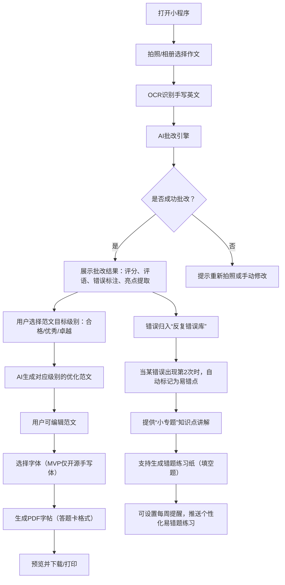

# PET作文批改与字帖生成小程序 PRD 文档（更新版）  
**版本**：V2.0（含范文目标设定、易错题专题与错题集）  
**日期**：2026年3月16日  
**产品经理**：[你的名字]  

---

## 1. 引言

### 1.1 背景
剑桥通用英语第二级（PET）考试在国内小升初及国际学校升学中具有重要地位。作文是PET考试中的必考部分，但家长普遍面临以下痛点：
- 缺乏专业批改能力，无法精准指出作文问题；
- 希望孩子能通过练字（衡水体）提升卷面分，但市面上缺乏与PET作文内容结合的字帖；
- 孩子的写作亮点无法有效积累和复用，学习缺乏延续性；
- 孩子反复出现同类错误，但缺少针对性巩固练习。

### 1.2 目标
开发一款微信小程序，通过拍照上传PET作文，实现：
- **智能批改**：基于PET官方评分标准（内容、沟通、语言）进行批改；
- **范文目标设定**：用户可选择范文的优化目标级别（合格/优秀/卓越），AI在保留原文亮点的同时，加入高级表达达到目标级别；
- **亮点积累**：提取孩子作文中的好词好句，形成个人亮点库，并在后续批改中智能调用；
- **易错点追踪**：自动识别反复出现的错误，提供“小专题”知识点讲解；
- **个性化错题集**：针对反复出错的句子生成填空题（挖空），形成可打印的练习纸（支持每周提醒生成）；
- **范文生成**：结合原文亮点和目标级别，生成一篇优化后的范文；
- **字帖生成**：将优化范文生成为可打印的PDF字帖（支持多字体，MVP阶段使用开源手写体，后续增加衡水体），并按照PET答题卡格式排版。

### 1.3 范围
- **MVP阶段**：聚焦PET作文（B1级别），支持拍照识别、批改、亮点库（本地存储）、生成字帖（开源手写体）、答题卡排版。  
  同时实现：范文目标级别选择（合格/优秀/卓越）、反复错误提醒（基于规则）、知识点简单讲解（文本形式）。
- **后续扩展**：增加KET作文支持、衡水体商用字体、多字体切换、错题本详细功能（填空题生成）、每周提醒推送、家长端同步、付费订阅。

---

## 2. 产品概述

### 2.1 产品定位
一款面向PET备考家庭的“AI写作教练+智能字帖生成器+个性化错题本”，通过批改-积累-练习的闭环，帮助孩子提升写作能力和卷面分。

### 2.2 用户画像
| 角色                 | 描述                                         | 核心需求                                                     |
| -------------------- | -------------------------------------------- | ------------------------------------------------------------ |
| 学生（PET备考者）    | 11-15岁，英语基础较好，正在备考PET考试       | 快速了解作文问题，获得高分范文，通过练字巩固范文，针对性攻克易错点 |
| 家长（购买决策者）   | 30-50岁，关注孩子升学，愿意为教育付费        | 获得专业批改报告，看到孩子进步轨迹，无需自己辅导作文，有针对性练习题 |
| 英语教师（辅助角色） | 培训机构或学校老师，可作为辅助工具推荐给学生 | 减轻批改负担，跟踪班级学情，获得班级共性错题集               |

### 2.3 使用场景
- **日常练习**：孩子完成一篇PET作文，家长拍照上传，获得批改、范文和字帖，同时记录本次错误。
- **考前冲刺**：集中练习历年真题，生成个性化错题集，强化薄弱环节。
- **每周巩固**：收到易错题练习纸推送，打印后填空练习，温故知新。
- **范文目标调整**：孩子可根据自身水平选择希望达到的范文级别（先求合格再求卓越），循序渐进。

---

## 3. 功能需求

### 3.1 整体流程图

### 3.2 功能模块详情

#### 模块一：拍照识别（同前）
| 功能       | 描述                                                   | 备注                            |
| ---------- | ------------------------------------------------------ | ------------------------------- |
| 拍照上传   | 调用微信相机，引导用户横屏拍摄，确保作文完整、光线充足 | 增加拍摄辅助框（答题卡大小）    |
| 相册选择   | 支持从相册选取已拍好的作文图片                         | 需提示用户选择清晰图片          |
| 图片预处理 | 自动裁剪、增强对比度，提高OCR准确率                    | 后端处理                        |
| OCR识别    | 接入第三方英文手写识别API，返回识别文本                | MVP阶段使用腾讯云/百度云标准API |

#### 模块二：AI批改（增强版）
| 功能                 | 描述                                                         | 备注                                       |
| -------------------- | ------------------------------------------------------------ | ------------------------------------------ |
| PET评分标准适配      | 基于官方PET作文评分维度（内容、沟通、语言）进行打分          | 需微调大模型或使用RAG技术                  |
| 错误标注             | 在原文中标出语法、拼写、用词错误，并给出修改建议             | 支持高亮显示                               |
| 亮点提取             | 识别文中优秀的词汇、句式，加入“我的亮点库”                   | 用户可手动确认是否加入                     |
| **范文目标级别设置** | 用户在批改结果页可选择优化目标：合格、优秀、卓越             | 级别越高，模型越倾向使用高级词汇和复杂句式 |
| **目标范文生成**     | 结合原文亮点和目标级别，生成一篇优化后的范文；若级别为卓越，则自动融入PET高分范文的典型表达 | 需设计prompt或微调模型，确保“顺势而为”     |
| 评分报告             | 展示总分及各维度得分，文字评语，下一步改进建议               | 可分享给家长或老师                         |

#### 模块三：亮点积累（用户记忆）（同前）
| 功能         | 描述                                                         | 备注                          |
| ------------ | ------------------------------------------------------------ | ----------------------------- |
| 个人亮点库   | 以列表形式展示历史提取的好词好句，可按日期、类型（词汇/句式）筛选 | MVP阶段本地存储，后续云端同步 |
| 亮点调用提醒 | 在批改新作文时，若检测到相关场景（如描写人物），自动提示“你上次用过…可以尝试…” | 需向量检索技术                |

#### 模块四：易错点追踪与小专题（新增核心模块）
| 功能                   | 描述                                                         | 备注                                       |
| ---------------------- | ------------------------------------------------------------ | ------------------------------------------ |
| 反复错误识别           | 对每次批改中标注的错误进行分类（如时态错误、主谓一致、介词搭配等），记录出现次数。当同一类型错误出现≥2次时，标记为“易错点” | 建立用户错误类型档案                       |
| 小专题讲解             | 针对每个易错点，提供1-2分钟的图文或短视频知识点讲解（如“一般过去时常见错误”），并附上3-5个典型例题 | 讲解内容由教育专家预设，或由大模型动态生成 |
| 错题练习生成（填空题） | 基于用户写过的错误句子（或其变体），自动生成填空题（如将错误的关键词挖空，让用户填写正确形式）。可生成单页练习纸（PDF） | 需设计句子改写和挖空算法，确保练习有效性   |
| 每周提醒推送           | 用户可开启每周提醒，系统将汇总本周新增易错点，生成一份“个性化易错题练习纸”推送给用户，支持一键打印 | 通过模板消息实现                           |

#### 模块五：字帖生成（同前，但可与错题集结合）
| 功能               | 描述                                                         | 备注                     |
| ------------------ | ------------------------------------------------------------ | ------------------------ |
| 字体选择           | MVP阶段默认使用一款开源英文手写体（如“Gochi Hand”），后期增加衡水体、手写楷体等 | 字体需商用授权           |
| 答题卡排版         | 按照PET作文答题卡格式生成PDF：横线格、固定行距、右侧留白（评分栏区域） | 需精确测量真实答题卡尺寸 |
| 预览与下载         | 生成PDF后提供预览，支持保存到手机、AirPrint打印、分享给微信好友 | PDF大小控制在2MB以内     |
| 个性化设置         | 可调整字体大小、是否显示拼音（暂不需要，PET无拼音）          | MVP阶段保持默认          |
| **错题练习纸排版** | 填空题练习纸采用A4格式，顶部显示“PET易错题练习 - 姓名：____ 日期：____”，下方为题目区域，每题包含挖空句子及提示（如动词原形） | 与字帖生成共用PDF引擎    |

#### 模块六：用户与数据管理（增强）
| 功能             | 描述                                                         | 备注               |
| ---------------- | ------------------------------------------------------------ | ------------------ |
| 微信授权登录     | 用户一键登录，自动创建账号                                   | 便于后续数据同步   |
| 历史记录         | 查看过往批改的作文、生成的范文、字帖和错题练习纸             | 按时间倒序排列     |
| 我的亮点库       | 查看、编辑、删除已积累的亮点                                 | 支持手动添加亮点   |
| **我的易错点**   | 展示所有被标记的易错点，点击可查看相关讲解和历次错误例句；支持手动删除（若已掌握） | 可导出为错题集PDF  |
| **每周提醒设置** | 开关“每周错题提醒”，选择提醒时间（如每周一早上8点）          | 需用户授权订阅消息 |

---

## 4. 非功能需求（同前）

### 4.1 性能需求
- **OCR识别**：单张图片识别时间 < 5秒；
- **AI批改**：单次批改时间 < 10秒（含范文生成）；
- **PDF生成**： < 3秒（字帖或错题练习纸）；
- **并发支持**：初期支持100用户同时使用，后期可扩展。

### 4.2 安全性
- 用户作文图片和文本数据加密存储；
- 不使用用户数据训练第三方模型，除非获得明确授权；
- 微信小程序需通过内容安全接口过滤违规内容。

### 4.3 兼容性
- 支持iOS和Android微信环境；
- PDF预览兼容主流手机（使用微信内置PDF预览组件）。

### 4.4 易用性
- 界面简洁，操作步骤不超过4步；
- 提供引导页，说明拍照技巧、批改流程以及范文目标级别的作用；
- 字体和排版需符合儿童阅读习惯（行距1.5倍，字体大小14pt+）。

---

## 5. 界面原型（文字描述）

### 5.1 首页（同前）
- 顶部：用户头像、累计批改篇数、亮点数量、易错点数量；
- 中间：大号按钮“拍照批改”，下方“历史记录”入口；
- 底部导航：首页、亮点库、易错点、我的。

### 5.2 拍照页（同前）
- 全屏相机预览，半透明答题卡框引导用户对齐；
- 下方按钮：拍照、从相册选择；
- 拍摄后自动进入识别加载页（转圈动画）。

### 5.3 批改结果页（增强）
- 顶部：总分（PET满分30分）及各维度得分；
- 原文区域：左侧原文，右侧标注错误（点击错误显示修改建议）；
- 亮点区域：展示被提取的亮点，按钮“加入亮点库”；
- **范文目标选择**：下方提供三个按钮（合格/优秀/卓越），默认选中“优秀”，点击后立即重新生成范文（可稍作加载提示）；
- 范文区域：展示优化后范文，按钮“生成字帖”；
- **错误归类提示**：若本次有错误被识别为“反复错误”（出现第2次），则在底部显示提示条：“你经常犯[时态]错误，点击查看小专题”，点击跳转至易错点详情。

### 5.4 易错点页面（新增）
- 顶部标题“我的易错点”，旁边有“生成练习纸”按钮；
- 列表展示每个易错点分类（如：一般过去时、介词搭配、主谓一致），显示错误次数和最后出现时间；
- 点击分类进入详情页：知识点讲解（图文）、例句集（带错误标注）、典型练习题（选择题/填空题）；
- 底部“生成本周练习纸”按钮，点击后立即生成一份包含所有当前易错点的填空题PDF，可预览/下载。

### 5.5 字帖生成页（同前，但可复用）
- 预览小图（模拟答题卡样式）；
- 字体选择（MVP仅“默认手写体”，后期增加下拉框）；
- 按钮“下载PDF”或“打印”；
- 下方提示：建议用A4纸打印。

### 5.6 亮点库页（同前）
- 列表展示已积累的亮点（句子/短语）；
- 每个亮点右侧可删除，点击可查看原文出处；
- 顶部搜索框，支持按关键词查找。

### 5.7 我的页（增强）
- 用户头像、昵称；
- 我的订单（付费订阅入口，后期）；
- 设置（字体管理、清除缓存、意见反馈）；
- **每周提醒开关**：开启后选择提醒时间。

---

## 6. 迭代规划

### 6.1 MVP版本（V1.0，开发周期3.5个月）
- 核心功能：拍照识别、AI批改（基于prompt模拟PET标准）、范文目标级别选择（合格/优秀/卓越）、生成开源手写体字帖、答题卡排版；
- 亮点库：本地存储，手动加入；
- 易错点追踪：仅记录错误类型并标记出现次数，提供简单的文本提示（无专题讲解）；
- 用户系统：微信登录；
- 发布平台：微信小程序。

### 6.2 V2.0（开发周期2个月）
- 增加KET作文批改；
- 引入衡水体等付费字体（需购买授权）；
- 易错点专题讲解（图文形式）；
- 错题练习纸生成（填空题，基于错误句子）；
- 每周提醒推送；
- 亮点库云端同步，支持向量检索提醒；
- 付费订阅模式（月卡/年卡），解锁无限次批改和高级字体。

### 6.3 V3.0（长期规划）
- 错题本增加语音讲解；
- 学习报告（周/月进步曲线，易错点趋势）；
- 家长端小程序，可查看孩子学习情况；
- 与培训机构合作，班级管理功能（班级错题集）。

---

## 7. 附录

### 7.1 术语表
| 术语   | 解释                                                         |
| ------ | ------------------------------------------------------------ |
| PET    | Preliminary English Test，剑桥通用英语第二级                 |
| OCR    | Optical Character Recognition，光学字符识别                  |
| MVP    | Minimum Viable Product，最小可行产品                         |
| 衡水体 | 一种手写印刷体，因衡水中学学生使用而得名，高考和剑桥考试中备受推崇 |
| 易错点 | 用户反复出现的错误类型，系统自动标记并归类                   |

### 7.2 参考资源
- 剑桥PET官方真题集 Trainer；
- 腾讯云/百度云OCR API文档；
- OpenAI/文心一言 API 文档；
- ReportLab PDF生成库；
- 英语语法常见错误分类体系。

---

**文档结束**