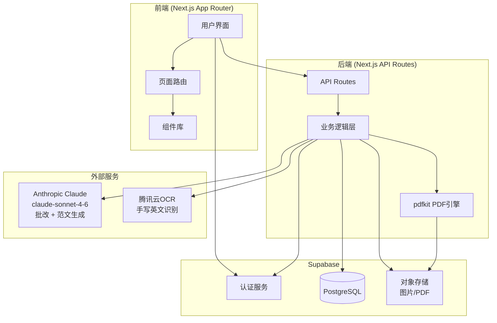
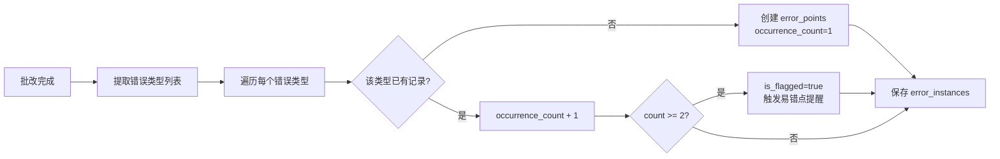
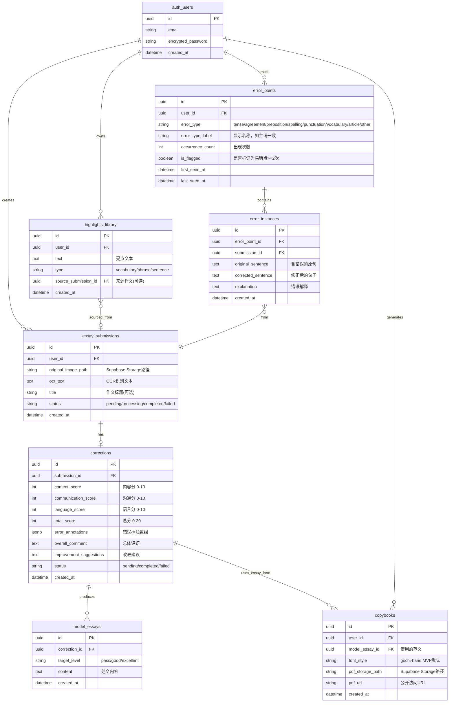
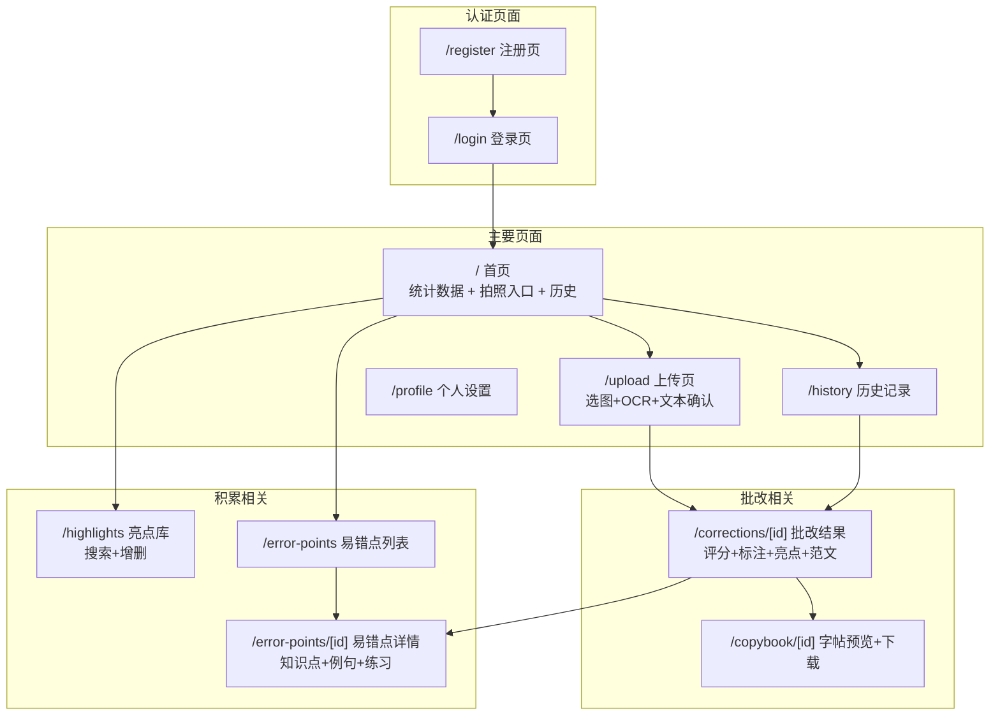

# KP作文宝 - 架构设计文档

## 项目概述

一款面向PET备考家庭的"AI写作教练+智能字帖生成器+个性化错题本"。
用户拍照上传手写作文 → OCR识别 → AI批改评分 → 亮点提取 → 范文生成 → 字帖PDF下载，同时自动追踪反复错误形成易错点档案。

---

## 技术栈

| 层级 | 技术选型 |
|-----|---------|
| 前端 | Next.js 14+ (App Router) + TypeScript + Tailwind CSS |
| 后端 | Next.js API Routes |
| 数据库 | Supabase (PostgreSQL) |
| 认证 | Supabase Auth (Email/Password) |
| 文件存储 | Supabase Storage |
| LLM | Anthropic Claude API (claude-sonnet-4-6) |
| OCR | 腾讯云手写英文 OCR API |
| PDF生成 | pdfkit (Node.js 服务端) |

---

## 1. 系统架构图



---

## 2. 核心业务流程图

```mermaid
flowchart TD
    Start([用户开始]) --> AuthCheck{已登录?}
    AuthCheck -->|否| Login[登录/注册]
    AuthCheck -->|是| Home[首页]
    Login --> Home

    Home --> Upload[拍照/上传图片]
    Upload --> UploadStorage[上传到 Supabase Storage]
    UploadStorage --> OCR[调用腾讯云OCR识别]
    OCR --> OCRResult{识别成功?}
    OCRResult -->|否| ManualInput[手动输入文本]
    OCRResult -->|是| TextConfirm[用户确认/编辑识别文本]
    ManualInput --> TextConfirm

    TextConfirm --> CreateSubmission[创建 essay_submissions 记录]
    CreateSubmission --> AICorrect[调用 Claude AI 批改]

    AICorrect --> ParseResult[解析批改结果 JSON]
    ParseResult --> SaveCorrection[保存 corrections 记录]
    SaveCorrection --> ExtractHighlights[批量保存亮点到 highlights_library]
    ExtractHighlights --> TrackErrors[记录错误到 error_points / error_instances]
    TrackErrors --> ShowResult[展示批改结果页]

    ShowResult --> SelectLevel[用户选择范文级别: 合格/优秀/卓越]
    SelectLevel --> GenEssay[调用 Claude 生成范文]
    GenEssay --> ShowEssay[展示范文]
    ShowEssay --> GenCopybook[点击生成字帖PDF]
    GenCopybook --> PDFKit[pdfkit生成PDF Buffer]
    PDFKit --> SavePDF[上传PDF到 Supabase Storage]
    SavePDF --> DownloadPDF[用户预览/下载]
```



### 易错点追踪流程



---

## 3. 数据模型图



### error_annotations JSONB 结构

```json
[
  {
    "start": 12,
    "end": 17,
    "original": "go to",
    "corrected": "goes to",
    "error_type": "agreement",
    "explanation": "第三人称单数主语需要动词加-s",
    "severity": "error"
  }
]
```

### 错误类型分类表

| error_type 值 | 显示名称 | 示例 |
|--------------|---------|------|
| tense | 时态错误 | "I go to school yesterday" |
| agreement | 主谓一致 | "She like apples" |
| preposition | 介词搭配 | "interested on music" |
| spelling | 拼写错误 | "recieve" → "receive" |
| punctuation | 标点符号 | 缺少句号、逗号滥用 |
| vocabulary | 词汇使用 | 词义不当、中式英语 |
| article | 冠词错误 | "I play a piano" |
| other | 其他错误 | 句子结构、逻辑等 |

---

## 4. 页面结构图



---

## 5. API 设计

### 文件上传

| 方法 | 路径 | 描述 |
|-----|------|-----|
| POST | /api/upload | 上传作文图片到 Supabase Storage，返回 storage_path 和 url |

### OCR

| 方法 | 路径 | 描述 |
|-----|------|-----|
| POST | /api/ocr | 腾讯云OCR识别，入参 image_url，返回识别文本 |

### 作文提交

| 方法 | 路径 | 描述 |
|-----|------|-----|
| POST | /api/essays | 创建提交记录 |
| GET | /api/essays | 获取用户作文列表（支持分页） |
| GET | /api/essays/[id] | 获取作文详情（含批改、范文列表） |

### 批改

| 方法 | 路径 | 描述 |
|-----|------|-----|
| POST | /api/correct | AI批改（评分+标注+亮点提取+错误追踪一步完成） |

### 范文生成

| 方法 | 路径 | 描述 |
|-----|------|-----|
| POST | /api/generate/model-essay | 按目标级别生成范文（已存在则直接返回） |

### 亮点库

| 方法 | 路径 | 描述 |
|-----|------|-----|
| GET | /api/highlights | 获取亮点列表（支持 search、type 过滤、分页） |
| POST | /api/highlights | 手动添加亮点 |
| DELETE | /api/highlights/[id] | 删除亮点 |

### 易错点

| 方法 | 路径 | 描述 |
|-----|------|-----|
| GET | /api/error-points | 获取易错点列表（支持 flagged_only 过滤） |
| GET | /api/error-points/[id] | 获取易错点详情（含所有错误实例） |

### 字帖生成

| 方法 | 路径 | 描述 |
|-----|------|-----|
| POST | /api/generate/copybook | 生成字帖PDF，上传到 Storage，返回 pdf_url |

### 统计

| 方法 | 路径 | 描述 |
|-----|------|-----|
| GET | /api/stats | 首页统计数据（批改数、亮点数、易错点数） |

---

## 6. 外部 API 集成

### 6.1 腾讯云手写英文 OCR

```
SDK: tencentcloud-sdk-nodejs
Action: RecognizeHandwritingOCR
Region: ap-guangzhou
认证: SecretId + SecretKey (HMAC-SHA256)
```

请求示例：
```json
{
  "Action": "RecognizeHandwritingOCR",
  "Version": "2018-11-19",
  "Region": "ap-guangzhou",
  "ImageUrl": "https://your-supabase-storage/essay-image.jpg"
}
```

响应处理：将 `TextDetections` 数组中各行文本按顺序合并为完整段落字符串。

### 6.2 Anthropic Claude API（AI批改）

```
端点: https://api.anthropic.com/v1/messages
模型: claude-sonnet-4-6
认证: x-api-key header
```

系统提示要求输出严格 JSON 格式，包含：

```json
{
  "scores": {
    "content": 7,
    "communication": 8,
    "language": 6,
    "total": 21
  },
  "overall_comment": "Overall a decent attempt...",
  "improvement_suggestions": "Focus on tense consistency...",
  "error_annotations": [
    {
      "start": 5,
      "end": 9,
      "original": "go to",
      "corrected": "goes to",
      "error_type": "agreement",
      "explanation": "第三人称单数主语...",
      "severity": "error"
    }
  ],
  "highlights": [
    {
      "text": "in spite of the heavy rain",
      "type": "phrase",
      "reason": "Effective use of contrast"
    }
  ],
  "error_summary": [
    {
      "error_type": "agreement",
      "error_type_label": "主谓一致",
      "count": 2
    }
  ]
}
```

### 6.3 Anthropic Claude API（范文生成）

Prompt 包含：原始作文文本 + 已提取亮点列表 + 目标级别说明

目标级别说明：
- `pass`：达到B1合格标准，语法基本正确，表达清晰
- `good`：词汇丰富，句式多样，逻辑清晰
- `excellent`：接近C1水平，高级词汇和复杂句式，融入PET高分典型表达

### 6.4 pdfkit 字帖规格

```
页面: A4 (595.28 x 841.89 pt)
边距: 上下各40pt，左右各60pt
字体: Gochi Hand Regular (OFL开源授权)
字号: 18pt
行高: 36pt（模拟PET答题卡横线间距）
横线颜色: #E0E0E0
文字颜色: #1E2E4D
右侧留白: 80pt（评分栏区域）
顶部标题: "PET Writing Practice"
超出A4自动换页
```

---

## 7. Supabase Storage 结构

```
essay-images/          # 私有桶（需 signed URL）
  {user_id}/
    {submission_id}.{ext}

copybook-pdfs/         # 公开桶（可直接 URL 访问预览）
  {user_id}/
    {copybook_id}.pdf
```

---

## 8. 环境变量

```env
# Supabase
NEXT_PUBLIC_SUPABASE_URL=your_supabase_url
NEXT_PUBLIC_SUPABASE_ANON_KEY=your_supabase_anon_key
SUPABASE_SERVICE_ROLE_KEY=your_service_role_key

# Anthropic Claude
ANTHROPIC_API_KEY=your_anthropic_api_key

# 腾讯云OCR
TENCENT_SECRET_ID=your_secret_id
TENCENT_SECRET_KEY=your_secret_key
TENCENT_OCR_REGION=ap-guangzhou
```

---

## 9. V2.0 预留扩展

以下功能在 MVP 中不实现，代码中以注释 `// V2.0: ...` 标记预留接口：

- **错题练习纸PDF**：基于 `error_instances` 自动生成填空题，A4格式
- **每周提醒推送**：cron + 邮件/微信模板消息
- **亮点向量检索**：pgvector 扩展 + embedding，批改时智能提醒相关亮点
- **KET作文支持**：`essay_submissions` 扩展 `exam_type` 字段
- **图文知识点讲解**：`knowledge_base` 表存储各错误类型的教学内容
- **付费订阅**：月卡/年卡解锁无限批改和高级字体
